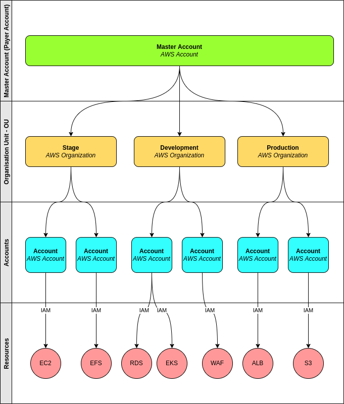

## Account Organization

## Foundations

- Important on start cloud project
- Is not only create AWS account
- One account is not better way to utilize AWS account
- AWS Billing is identified by account
- Does not exist Wrong, the wrong is not has strategy

Hierarchical account strategy to better __Organization__ and __Security__.  This account strategy, the sub accounts is to organizate domain sections, centralize billing and restrict resource create permission based sub-account.

- __Master Account__: Composed by only one AWS Account. In this account, only _Root Account_ it used. This account is the first account created and is is to create or associate other sub-accounts. This account function is to unify sub-accounts billing only, no new __Resources__ should be created.

> :memo: _Root Account_ is the user who owns an AWS Account.

- __Oraganisation Unit - OU__: Visually organize AWS Accounts and service security rules. Normally, it was created to Domain Departaments.

> :memo: To indetify Domain Departaments, a one way is understood characteristic about the resources presents it. If Type, Lifecycle and, Permissions are differents, maybe it's a Department. 

- __Accounts__: Account when will be create resources and deployments. Each account has identity that associate resources created in it. The users should be created in this account.

- __Resources__: AWS services and resources, for example: EC2, S3, EKS, EFS etc.

Dont be confused Master Account with Root Account. Master Account is the first account created on AWS and Root Account is the user who owns an AWS Account.

## Account Security Pratices

For all accounts, Root Accounts specially, it is recommend enable MFA.

For create new accounts, it is necessary one unique email. The best pratice is create email group for the team and not used person emails.

Add security contacts in Root Account. It is important that someone listen. 

## AWS Support Center

## Create Organisation Unit

## SCP - Security Control Process
